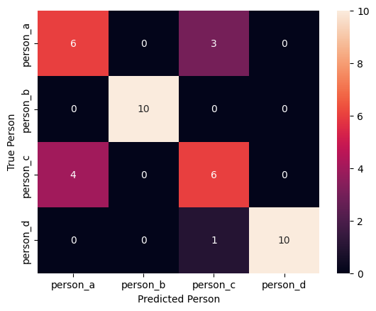

# Deep Learning Transfer Learning

## Author 

- Paul Ashioya

## Description

I started by downloading the `VGG Face Dataset `and explored it to find images of my favorite celebrities. My goal was to create a small dataset for the assignment, comprising 20 training and 10 testing images each for person A and person B. Additionally, I included 10 testing images for person C, who bears resemblance to person A, and 10 testing images for person D, resembling person B. To ensure some shared characteristics, I used my own judgment, considering factors like gender, similar hair types, and whether they wore glasses. Utilizing `OpenCV`, I implemented code to detect faces in the images and extract them.

To ensure interesting differences between faces, both within each group and between persons A and B, I carefully curated the dataset. I created a visual overview of all the faces, incorporating labels and titles to explain my choices for including these individuals.

Moving on to the deep learning aspect, I recognized the ubiquity of deep learning and decided to apply it in its simplest form. Instead of training a neural network from scratch, I opted to use the face features from a pre-trained `Convolutional Neural Network` (CNN). After reviewing various papers on Face Recognition and considering open-source implementations, I chose the `VGG16` model.

For the assignment, I aimed to train a binary classifier capable of recognizing person A (class 0) and person B (class 1). I tested the model on the designated test set and computed the mean accuracy. I also examined how well the model predicted test images of persons C and D.

To further challenge the classifier and understand its limitations, I introduced modifications and additional test images. These modifications included variations in lighting, rotations, partial obstruction of faces, and instances where individuals wore glasses. I observed and explained how these alterations impacted the model's performance, gaining insights into what breaks the classifier and why.

## Results

The Results are decent, getting on average 83% accuracy on the predictions. More hyper parameter tuning and possibly model adjustments are needed to improve the accuracy. for example im experimenting with using `VGG19` instead of `VGG16`

